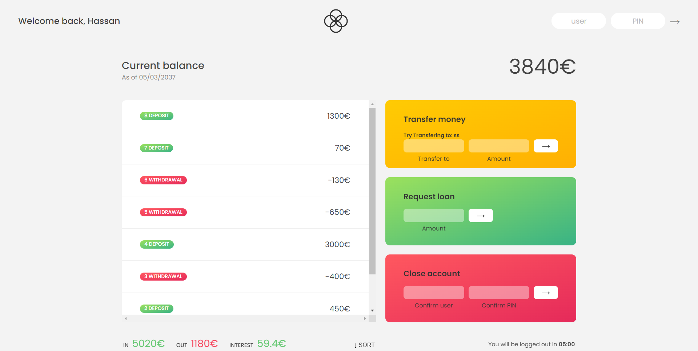

<<<<<<< HEAD

# Bankist - Web App to manage Bank Account!

This is a Web App that is built with Javascript ES6+. This App allows user to manage their bank account by loggin in.

## Table of contents

- [Overview](#overview)
  - [The challenge](#the-challenge)
  - [Links](#links)
- [My process](#my-process)
  - [Built with](#built-with)
- [Author](#author)

## Overview

### The challenge

Users should be able to:

- Login to their acccount.
- View Transactions.
- Transfer to another account.
- Get Loan
- Terminate their account.
- View the cart and remove items from it

### Links

- Live Site URL: [Bankist](https://hasni.co/portfolio/bankist)

## My process

### Built with

- Javascript ES6+
- CSS custom properties
- Flexbox

## Author

- Website - [Hasni.co](https://www.hasni.co/)
- Upwork - [@HassanR](https://www.upwork.com/freelancers/~01d9a777c26f1c5271)
- Fiverr - [@HSN_Studio](https://www.fiverr.com/hsn_Studio)

# bankist

Bankist is a Web App that allows users to manage their account by logging in.
